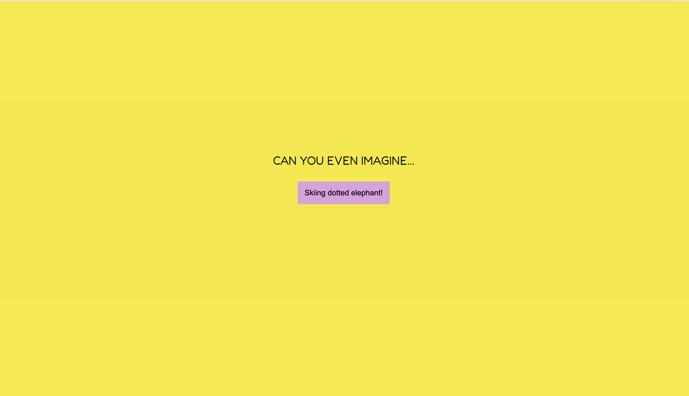

<h1 align="center"><strong>Mixed Messages Program</strong></h1>
 

## Preview with Pages
https://zewela.github.io/mixed-messages/ 

## Description 
Codecademy project.  
Every time a user runs a program, they should get a new, randomized output.  
In my version it will be fantastic-fictional sentance! 

### Features 
The message that the program outputs is made up of three different pieces of data to make it truly random.

### Technologies
+ JavaScript
+ HTML
+ CSS
+ Git
+ GitHub
+ Node

